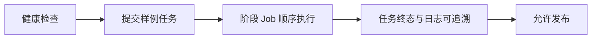

# 发布门禁

## 1. 上线前必检

1. 核心 Pod 全部 Ready
2. `/api/health` 200
3. `/api/system` 返回 runtime 基线
4. 提交任务后阶段 Job 可按顺序生成
5. 任务详情可返回关键字段（phase/error_code/error_kind/signature）

## 2. 发布检查图



## 3. 回滚

```bash
kubectl -n sherpa rollout undo deploy/sherpa-web
kubectl -n sherpa rollout undo deploy/sherpa-frontend
```
