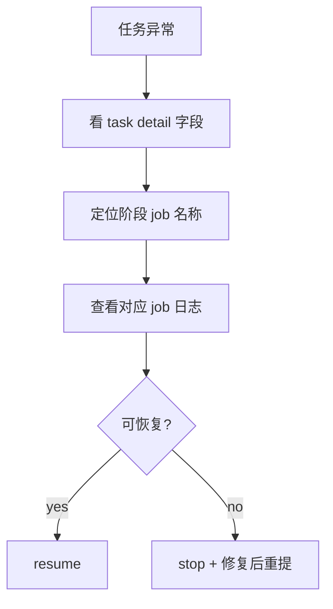

# K8s 运行手册

## 1. 快速诊断

```bash
kubectl -n sherpa get pods
kubectl -n sherpa get svc
kubectl -n sherpa get ingress
kubectl -n sherpa port-forward svc/sherpa-web 8001:8001
curl -sS http://127.0.0.1:8001/api/system | jq
curl -sS http://127.0.0.1:8001/api/metrics | head
```

## 2. 日志定位

```bash
kubectl -n sherpa logs deploy/sherpa-web --tail=200
kubectl -n sherpa logs deploy/sherpa-frontend --tail=200
kubectl -n sherpa logs statefulset/postgres --tail=200
```

任务日志：

```bash
curl -sS http://127.0.0.1:8001/api/task/<job_id> | jq '.log'
```

## 3. 阶段级排障

1. 从 `/api/task/<job_id>` 取 `phase/error_code/error_kind/error_signature`。
2. 读取 `k8s_job_name/k8s_job_names`。
3. 逐个查看阶段 Job 日志：

```bash
kubectl -n sherpa logs job/<stage-job-name> --tail=200
```

## 4. 控制操作

```bash
curl -sS -X POST http://127.0.0.1:8001/api/task/<job_id>/stop
curl -sS -X POST http://127.0.0.1:8001/api/task/<job_id>/resume
```

## 5. 排障流程图


