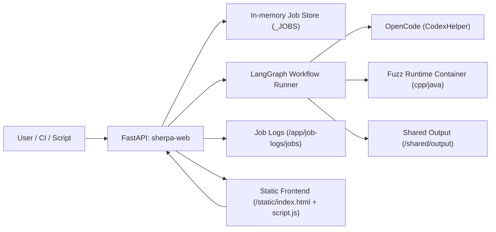
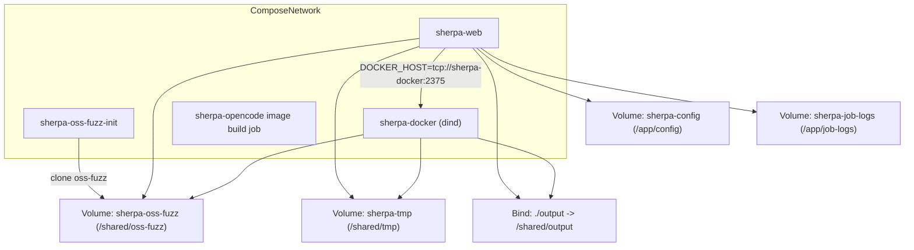
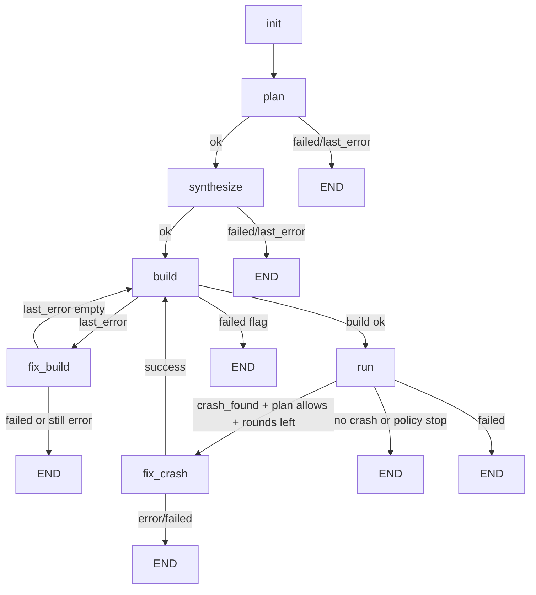
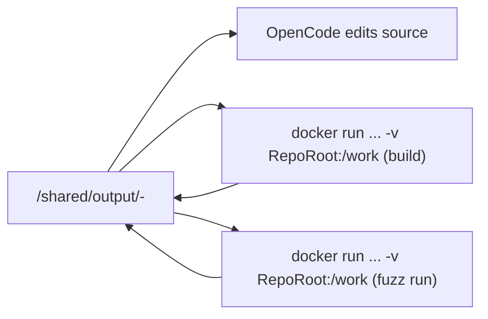

# Sherpa 技术对接文档（详细版）

文档目标：给研发、测试、平台、运维团队提供统一的实现级说明，避免“理解偏差”导致联调失败。  
适用范围：当前仓库主路径（Docker-only Web API + LangGraph workflow）。

---

## 1. 项目定位与当前主路径

Sherpa 是一个自动化 fuzz 编排系统，面向“无现成 harness 的 Git 仓库”，自动执行：

`plan -> synthesize -> build -> run -> (optional fix_crash) -> summary`

当前线上主路径是：

1. FastAPI (`harness_generator/src/langchain_agent/main.py`) 接收任务。
2. 每个 repo 作为子任务执行 `run_fuzz_workflow(...)`。
3. 工作流由 `harness_generator/src/langchain_agent/workflow_graph.py` 定义。
4. 代码编辑通过 OpenCode（`CodexHelper`）完成，构建/运行在独立 fuzz runtime 容器完成。

关键变化（相对历史实现）：

1. 已删除 `decide` 节点。
2. `plan` 节点负责“规划 + 结束策略（crash policy/max fix rounds）”。
3. OpenCode 提示词由代码硬编码改为统一 md 模板：
`harness_generator/src/langchain_agent/prompts/opencode_prompts.md`

---

## 2. 总体架构

### 2.1 组件架构图



### 2.2 容器拓扑图（docker-compose）



---

## 3. 代码结构与职责边界

| 模块 | 文件 | 职责 |
|---|---|---|
| Web API | `harness_generator/src/langchain_agent/main.py` | 配置读写、任务提交、任务聚合查询、日志分流与落盘 |
| Workflow | `harness_generator/src/langchain_agent/workflow_graph.py` | 节点定义、条件路由、终态报告写入 |
| Repo fuzz 执行器 | `harness_generator/src/fuzz_unharnessed_repo.py` | clone/build/run/crash 分析/打包等底层动作 |
| OpenCode 封装 | `harness_generator/src/codex_helper.py` | OpenCode 调用重试、超时、无执行策略、diff 判定 |
| 配置持久化 | `harness_generator/src/langchain_agent/persistent_config.py` | `web_config.json` 持久化与环境变量同步 |
| 前端 | `harness_generator/src/langchain_agent/static/index.html` + `script.js` | 任务提交、会话绑定、实时进度与日志分类展示 |
| 提示词模板 | `harness_generator/src/langchain_agent/prompts/opencode_prompts.md` | plan/synthesize/fix_* 的统一模板 |
| 编排 | `docker-compose.yml` | web + dind + init + volumes 拓扑 |

补充：`harness_generator/src/harness_generator.py` 是传统 OSS-Fuzz 模式入口，不是当前 Web 主路径。

---

## 4. 任务与工作流执行模型

## 4.1 Web 层任务模型

`POST /api/task` 接收一个父任务（kind=task），包含 N 个子任务（kind=fuzz）。  
父任务只做提交与聚合；子任务真正执行 workflow。

父/子任务状态：`queued | running | success | error`

父任务最终状态是对子任务聚合推导：

1. 有任一 queued/running -> `running`
2. 全部结束且存在 error -> `error`
3. 全部 success -> `success`

## 4.2 Workflow 状态机（LangGraph）



## 4.3 节点详细说明（包含“是否使用 LLM”与“写文件”）

| 节点 | 是否调用 LLM/OpenCode | 主要输入 | 主要输出状态 | 关键写文件 |
|---|---|---|---|---|
| `init` | 否 | repo_url/time_budget/run_time_budget/docker_image | 初始化 generator、repo_root、计数器 | 创建工作目录 |
| `plan` | 是 | 仓库代码 | `codex_hint`、`plan_fix_on_crash`、`plan_max_fix_rounds` | `fuzz/PLAN.md`、`fuzz/targets.json` |
| `synthesize` | 是 | `PLAN.md` + `targets.json` + hint | 生成可构建脚手架 | `fuzz/build.py`、harness 源码、可选 `fuzz/system_packages.txt` |
| `build` | 否（纯执行） | build 脚本 | build rc/tail/signature | `fuzz/build_full.log`、`fuzz/out/*` |
| `fix_build` | 是（必要时） | build 日志摘要 + full log | 清空错误并回 build | 编辑 `fuzz/*`/最小 build glue |
| `run` | 否（纯执行） | fuzzer 二进制 | crash_found/run_details | `fuzz/corpus/*`、`fuzz/out/artifacts/*`、`crash_info.md`、`crash_analysis.md`、`reproduce.py`、bundle 目录 |
| `fix_crash` | 是 | crash_info/crash_analysis/artifact | patch 信息并回 build | `fix.patch`、`fix_summary.md` |
| workflow end | 否 | 全量状态 | 最终返回 message | `run_summary.md/json` + `fuzz/out/fuzz_effectiveness.md/json` |

---

## 5. LLM/OpenCode 在 plan、decide、fix 中的真实职责

## 5.1 plan 节点中的 LLM 工作

1. 产出目标清单与理由：`fuzz/targets.json`
2. 产出执行计划：`fuzz/PLAN.md`
3. 提供后续可执行 hint：`codex_hint`
4. 通过 `PLAN.md` 指定 crash 后策略：
`Crash policy: report-only|fix` 与 `Max fix rounds: N`

## 5.2 decide 节点现状

当前代码中无 `decide` 节点。  
路由逻辑由 `_route_after_plan/_route_after_build/_route_after_run/...` 直接完成。

## 5.3 fix_build/fix_crash 与 LLM 的分工

`fix_build` 先尝试本地热修（不经 LLM），仅在必要时调用 OpenCode：

1. `-stdlib=libc++` 与环境不匹配热修
2. `main` 冲突热修（如 `-Dmain=vuln_main`）
3. `cannot find -lz` 热修
4. 若仍失败，OpenCode 按模板 + full log 修复

`fix_crash` 通过 `HARNESS ERROR` 判断走两类提示词：

1. harness error -> 修 harness/build glue
2. upstream bug -> 修上游代码

---

## 6. “在哪个节点写 build/fuzz 后续所需文件”

你关心的核心点如下：

1. 给后续 `build` 准备文件的节点是 `synthesize`：
   - 至少写出 `fuzz/build.py` + harness 源码
2. 给后续 `run` 准备文件的是 `build`：
   - 产出 `fuzz/out/<fuzzer>`
3. 给 crash 复现与判断准备文件的是 `run`：
   - `crash_info.md`、`crash_analysis.md`、`reproduce.py`
4. 给后续修复追踪准备文件的是 `fix_crash`：
   - `fix.patch`、`fix_summary.md`

---

## 7. API 契约（对接必须）

## 7.1 `POST /api/task`

请求体（关键字段）：

```json
{
  "jobs": [
    {
      "code_url": "https://github.com/madler/zlib.git",
      "email": null,
      "model": "deepseek/deepseek-reasoner",
      "max_tokens": 1000,
      "time_budget": 900,
      "total_time_budget": 900,
      "run_time_budget": 900,
      "docker": true,
      "docker_image": "auto"
    }
  ],
  "auto_init": true,
  "build_images": true,
  "images": null,
  "force_build": false,
  "oss_fuzz_repo_url": null,
  "force_clone": false
}
```

返回：

```json
{
  "job_id": "<parent_task_id>",
  "status": "queued"
}
```

说明：

1. Docker-only 强制开启，不允许非 docker 任务。
2. `total_time_budget` 控制整条 workflow 总时长。
3. `run_time_budget` 控制单次 fuzz 运行预算（传入 generator 的 `time_budget_per_target`）。

## 7.2 `GET /api/task/{job_id}`

返回父任务聚合状态 + 子任务详情。  
前端会根据 `children_status` 与活跃子任务日志渲染进度。

## 7.3 `GET /api/tasks?limit=N`

返回最近任务列表，供“会话绑定/历史会话”面板展示。

## 7.4 `GET /api/system`

返回系统级状态：

1. 服务 uptime
2. job 计数
3. active jobs
4. 日志目录大小
5. 当前配置摘要

## 7.5 `GET/PUT /api/config`

配置存储在 `config/web_config.json`（容器中为持久卷 `/app/config`）。

---

## 8. 前端实时进度与日志语义

前端代码：`harness_generator/src/langchain_agent/static/script.js`

核心机制：

1. 系统轮询：`/api/system`（2s）
2. 会话列表轮询：`/api/tasks`（5s）
3. 绑定会话后轮询：`/api/task/{id}`

日志分类策略（避免把正常日志当错误）：

1. 显式失败匹配：Traceback、`Docker build failed (rc=...)`、`error during connect` 等
2. warning 匹配：`WARN`、`DEPRECATED`、`warning:`
3. workflow/job/helper/cmd 单独标记为信息类

这套逻辑用于把：

1. 正常构建/命令回显 -> 信息
2. 真失败 -> 错误
3. 风险提示 -> 警告

---

## 9. 文件与目录生命周期

## 9.1 输出目录结构（单任务）

默认根目录：`SHERPA_OUTPUT_DIR`，compose 下是 `/shared/output`，宿主机映射 `./output`。

典型结构：

```text
output/
  zlib-2f67cd6b/
    fuzz/
      PLAN.md
      targets.json
      build.py
      build_full.log
      system_packages.txt            # 可选
      out/
        gzread_fuzz
        artifacts/
          crash-*
        fuzz_effectiveness.md
        fuzz_effectiveness.json
      corpus/
        gzread_fuzz/
          seed_*
    crash_info.md
    crash_analysis.md
    reproduce.py
    fix.patch                        # 可选
    fix_summary.md                   # 可选
    run_summary.md
    run_summary.json
    challenge_bundle*/false_positive*/unreproducible*
```

## 9.2 Job 日志文件

主日志：

1. `/app/job-logs/jobs/<job_id>.log`

分流日志（同目录）：

1. `...level.info.log|warn.log|error.log`
2. `...cat.workflow.log|cat.build.log|cat.opencode.log|cat.docker.log|...`

---

## 10. 配置模型与环境变量矩阵

## 10.1 持久化配置字段（`WebPersistentConfig`）

配置文件字段（部分）：

1. OpenAI/OpenRouter key/base/model
2. `fuzz_time_budget`
3. `fuzz_docker_image`（默认 `auto`）
4. `oss_fuzz_dir`
5. `sherpa_git_mirrors`
6. `sherpa_docker_http_proxy/https_proxy/no_proxy/proxy_host`

`PUT /api/config` 的安全行为：

1. 前端传 `null` 时会保留原 secret，不会被清空
2. 强制 `fuzz_use_docker=true`

## 10.2 关键环境变量（运行期）

| 变量 | 用途 | 默认 |
|---|---|---|
| `SHERPA_OUTPUT_DIR` | 任务输出根目录 | 空（compose 中 `/shared/output`） |
| `SHERPA_CODEX_CLI` | OpenCode CLI 名称 | `opencode` |
| `SHERPA_OPENCODE_DOCKER_IMAGE` | OpenCode 执行容器 | 空（compose 设 `sherpa-opencode:latest`） |
| `SHERPA_ACCEPT_DIFF_WITHOUT_DONE` | 允许无 sentinel 仅凭 diff 通过 | `0`（web 启动时设置） |
| `SHERPA_WEB_JOB_LOG_DIR` | Job 日志目录 | `/app/job-logs/jobs` |
| `SHERPA_WORKFLOW_MAX_STEPS` | workflow 最大步数 | `20` |
| `SHERPA_WORKFLOW_BUILD_LOCAL_RETRIES` | build 节点本地重试次数 | `2` |
| `SHERPA_WORKFLOW_MAX_SAME_BUILD_ERROR_REPEATS` | 相同 build 错误重复阈值 | `2` |
| `SHERPA_WORKFLOW_MAX_SAME_CRASH_REPEATS` | 相同 crash 重复阈值 | `1` |
| `SHERPA_WORKFLOW_STOP_ON_INFRA_BUILD_ERROR` | 基础设施错误是否直接停 | 默认开启 |
| `SHERPA_PLAN_STRICT_TARGETS_SCHEMA` | targets.json 严格校验 | `1` |
| `SHERPA_DOCKER_IMAGE_CPP/JAVA` | 运行镜像 tag | `sherpa-fuzz-cpp/java:latest` |

## 10.3 compose 中必须关注的变量

1. `DOCKER_HOST=tcp://sherpa-docker:2375`
2. `DOCKER_BUILDKIT=0`（规避 buildx 缺失问题）
3. `TMPDIR=/shared/tmp`（保证 web 与 dind 可共享）
4. `SHERPA_DEFAULT_OSS_FUZZ_DIR=/shared/oss-fuzz`

---

## 11. 容器边界与仓库在步骤间传递

你的问题“仓库如何在不同步骤间传递”对应机制如下：

1. 每个 repo clone 到输出目录（通常在 `/shared/output/<repo>-<id>`）
2. build/run 时把该目录作为 volume 挂载到 fuzz runtime 容器的 `/work`
3. OpenCode 运行在独立环境，编辑同一仓库目录（文件系统共享结果）
4. workflow 节点通过同一路径上的文件进行“状态传递”（而非内存对象跨容器传输）

简图：



---

## 12. 失败处理、重试与停止条件

## 12.1 build 失败处理

`build` 节点：

1. 支持多次本地重试
2. 可选 `--clean` 重试
3. 生成 full log：`fuzz/build_full.log`
4. 无 fuzzer 二进制时也视为失败
5. 同签名错误重复达到阈值直接停止

`fix_build` 节点：

1. 先本地 hotfix（无需 LLM）
2. 检测“非源码问题”（docker daemon/network/资源耗尽/timeout）可直接停止
3. OpenCode 修复后若“无相关文件变化”判定 no-op，停止回路

## 12.2 run/crash 处理

`run` 节点：

1. 支持 sanitizer 日志判定 crash（即使没有原生 artifact）
2. 产出 `run_details` 指标（cov/ft/corpus/execs/rss 等）
3. 同 crash 签名重复达到阈值停止

`fix_crash` 节点：

1. 根据 `HARNESS ERROR` 选择提示词
2. 输出 `fix.patch` 与 `fix_summary.md`
3. 无文本改动时判定 no-op

## 12.3 预算与上限

1. 总预算：`time_budget/total_time_budget`
2. 单次 run 预算：`run_time_budget`
3. 全流程最大步数：`SHERPA_WORKFLOW_MAX_STEPS`

触发超限时 message 为：

1. `workflow stopped (time budget exceeded)`
2. `workflow stopped (max steps reached)`

---

## 13. OpenCode 安全与执行策略

实现文件：`harness_generator/src/codex_helper.py`

核心策略：

1. 默认禁止 OpenCode 执行 build/test/run 类命令（PATH shim blocklist）
2. 仅允许读命令辅助定位（如 `rg/ls/cat`）
3. 通过 `done` sentinel + `git diff HEAD` 双条件判定成功
4. 可配置“无 sentinel 但有 diff”是否接受（`SHERPA_ACCEPT_DIFF_WITHOUT_DONE`）

重要边界提示（模板中明确）：

1. build/fuzz 在独立 runtime 容器，不在 OpenCode 环境
2. OpenCode 只负责改代码，不做运行验证

---

## 14. 部署、重构容器与日常运维

## 14.1 启动

```bash
docker compose up -d --build
```

## 14.2 健康检查

```bash
curl -s http://localhost:8000/api/system
```

## 14.3 常见问题

1. `BuildKit is enabled but the buildx component is missing`
   - 当前逻辑会自动 fallback `DOCKER_BUILDKIT=0`
2. `lookup sherpa-docker ... no such host`
   - 说明当前进程不在 compose 网络，或 `DOCKER_HOST` 指向错误
3. 任务长时间运行
   - 检查 `run_time_budget` 是否过大
   - 检查 workflow 是否在 build/fix 循环，查看 `build_full.log` 与 `same_*_repeats` 终止条件

---

## 15. 测试覆盖与质量基线

测试目录：`tests/`

重点覆盖：

1. API 稳定性与 Docker-only 策略
2. build 重试/clean 重试/路径回退
3. run 节点 crash 判定与 run_details 指标
4. prompt/targets schema 校验
5. docker path translation 与 deps 自动安装脚本注入
6. summary 与 fuzz effectiveness 报告生成

建议执行：

```bash
pytest -q
```

---

## 16. 对接清单（给团队）

联调前 checklist：

1. 确认 compose 服务健康：`sherpa-web`、`sherpa-docker`
2. 确认 `OPENAI_API_KEY` 或 `OPENROUTER_API_KEY` 已配置
3. 确认输出卷可写：`./output`
4. 确认 UI 可读 `/api/tasks` 和 `/api/task/{id}`
5. 确认运维侧知道 `total_time_budget` 与 `run_time_budget` 含义差异
6. 确认告警系统根据“任务状态 + 显式错误日志”判断失败，不要仅按关键字误报

---

## 17. 建议的后续工程化增强

1. 将 env matrix 生成成机器可读 schema（JSON）并在启动时校验
2. 为前端日志分类增加单元测试样本（误报/漏报回归）
3. 增加 `/api/task/{id}/events` 结构化事件流，减少前端正则解析复杂度
4. 把 workflow state 核心字段落盘，便于跨进程恢复和离线审计

---

## 18. 关键路径文件索引

1. `harness_generator/src/langchain_agent/main.py`
2. `harness_generator/src/langchain_agent/workflow_graph.py`
3. `harness_generator/src/fuzz_unharnessed_repo.py`
4. `harness_generator/src/codex_helper.py`
5. `harness_generator/src/langchain_agent/persistent_config.py`
6. `harness_generator/src/langchain_agent/prompts/opencode_prompts.md`
7. `harness_generator/src/langchain_agent/static/index.html`
8. `harness_generator/src/langchain_agent/static/script.js`
9. `docker-compose.yml`
10. `docker/Dockerfile.web`
11. `docker/Dockerfile.fuzz-cpp`
12. `docker/Dockerfile.fuzz-java`
13. `docker/Dockerfile.opencode`

