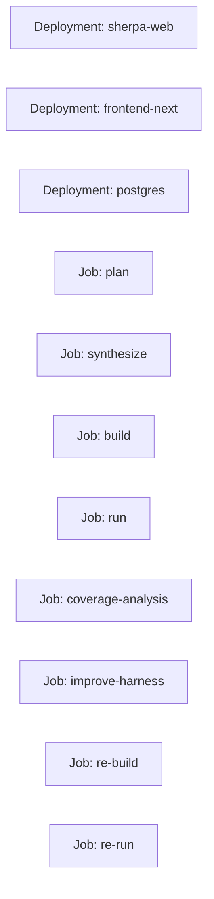

# Kubernetes Manifests

本目录包含 Sherpa 当前线上部署使用的 Kubernetes 清单。

当前口径：

- 常驻服务使用 Deployment
- workflow stage 使用短生命周期 Job
- `k8s_job` 是唯一线上主执行模式
- worker 容器内原生执行 `opencode`

## 目录

- `base/`
  - 基础资源：`sherpa-web`、`frontend-next`、`postgres`、ConfigMap、Secret、PVC 等
- `overlays/dev`
  - 开发环境覆盖层
- `overlays/prod`
  - 生产环境覆盖层
- `overlays/cloudflare`
  - 域名与 tunnel 相关附加资源

## 常驻组件 vs 短任务组件

## 参考文档

- `docs/k8s/DEPLOY.md`
- `docs/k8s/DEPLOYMENT_DETAILED.md`
- `docs/k8s/MAPPING.md`
- `docs/k8s/RUNBOOK.md`
